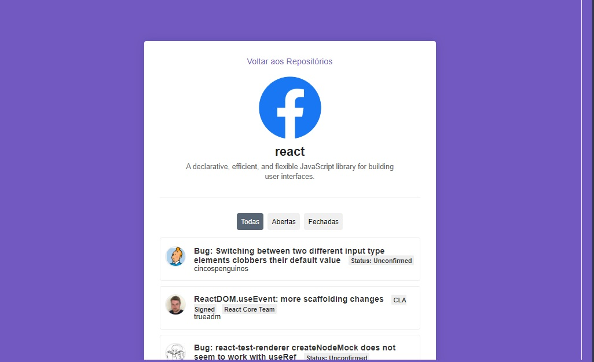

<h3 align="center">
  Go Stack - Desafio 5: Primeiro projeto com ReactJS
</h3>

<h1 align="center">
  
</h1>

### Funcionalidades

Aplicação que busca na API de repósitorio do Github, como nome e issues assim listando todas os repositorios adicionados no input.

#### Funções adicionadas

#### 1. Captando erros

Adicionado um `try/catch` por volta do código presente na função `handleSubmit` presente no componente `Main` e caso um repositório não seja encontrado na API do Github adicione uma borda vermelha por volta do input em que o usuário digitou o nome do repositório.

#### 2. Repositório duplicado

Antes de fazer a chamada à API na função `handleSubmit` é feita verificação para ver se o repositório não está duplicado, ou seja, se ele ainda não existe no estado de `repositories`.

Caso exista, disparado um erro, e com isso o código cairá no `catch` do `try/catch` criado na funcionalidade anterior.

#### 3. Filtro de estado

Filtro de estado na listagem de Issues no detalhe do repositório. O estado representa se a issue está em aberto, fechada ou uma opção para exibir todas.

#### 4. Paginação

Adicionada paginação nas issues listadas no detalhe do repositório.

Adicionados botões de próxima página e página anterior. O botão de página anterior fica desativado na primeira página.

#### 5. Prints

<h1 align="center">
  
</h1>

<h1 align="center">
  
</h1>
